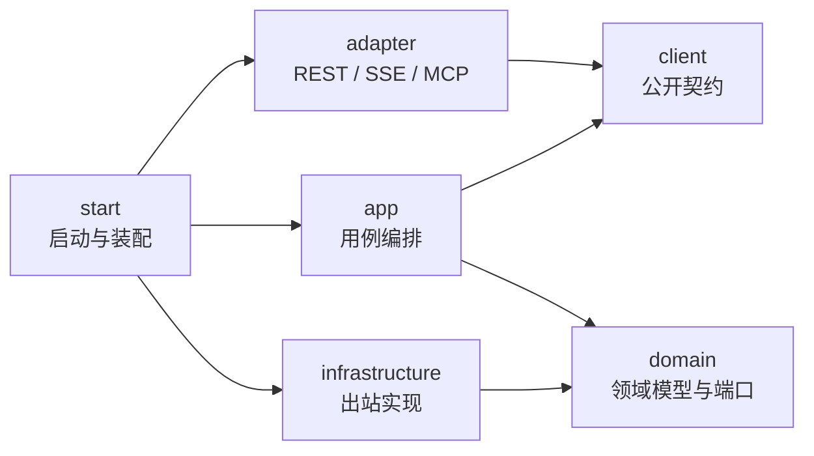

# 架构说明

## 1. 设计目标

这套骨架用于承载多个可独立演进的业务 Agent。它优先解决三个问题：

1. 业务规则不直接依赖 Spring MVC、AgentScope、数据库 SDK 等外部技术。
2. 新增 Agent 时通过扩展端口注册，不修改统一入口和路由主流程。
3. 用自动化测试阻止模块依赖在持续迭代中逐渐失控。

当前只采用 COLA 的分层和依赖思想，没有引入 COLA Component。等项目出现明确的扩展点、状态机或统一异常需求后，再按实际需要添加组件，避免为了“看起来企业级”而增加无效依赖。

## 2. 依赖方向



核心约束：

- `client` 和 `domain` 不依赖任何其他内部模块。
- `app` 只负责编排，不引用 Controller、数据库实现或 AgentScope 类型。
- `adapter` 只通过 `client` 暴露的门面调用用例，不直接访问 `app` 实现。
- `infrastructure` 实现 `domain` 定义的端口，外部 SDK 类型不能向内泄漏。
- `start` 是唯一的装配根，可以看到所有模块，但不承载业务规则。

这些约束由 `LayerDependencyTest` 持续验证。

## 3. 当前请求链路

```text
POST /api/v1/agents/{agentKey}/chat
  -> AgentChatController
  -> AgentChatFacade
  -> DefaultAgentChatFacade
  -> 根据 AgentKey 选择 AgentExecutor
  -> EchoAgentExecutor
```

`EchoAgentExecutor` 是架构验收桩。它证明扩展端口、自动注册、路由和 REST 映射都能工作，后续应由真实 Agent 插件替代。

## 4. Data Query Agent 的建议边界

后续将 `dodo-agentx` 接入时，建议新增 `agent-plugin-data-query`，内部继续按职责拆分：

- Agent 编排：意图识别、澄清、SQL 生成、校验、执行和结果解释。
- 元数据：数据目录、表关系、指标口径和示例 SQL。
- 安全策略：只读连接、语句类型白名单、表字段权限、脱敏、限时限量。
- 审计：用户、问题、生成 SQL、执行耗时、结果规模和失败原因。
- 基础设施：LLM、AgentScope、数据库、缓存和观测系统适配器。

业务插件只需实现 `AgentExecutor`。如果未来需要流式输出或中断，不要修改现有同步契约来硬塞状态，而应增加独立的流式用例接口。

## 5. 从 gogo-agent 迁移的原则

迁移应按能力切片进行，而不是按原目录整包复制：

1. 先识别通用能力与差旅业务能力。
2. 把通用运行时、会话、工具注册、事件和观测能力放入脚手架边界。
3. 把差旅实体、提示词、工具和数据集留在原业务侧，不进入开源脚手架。
4. 每迁移一条链路，都通过模块测试和真实接口验收后再迁下一条。
